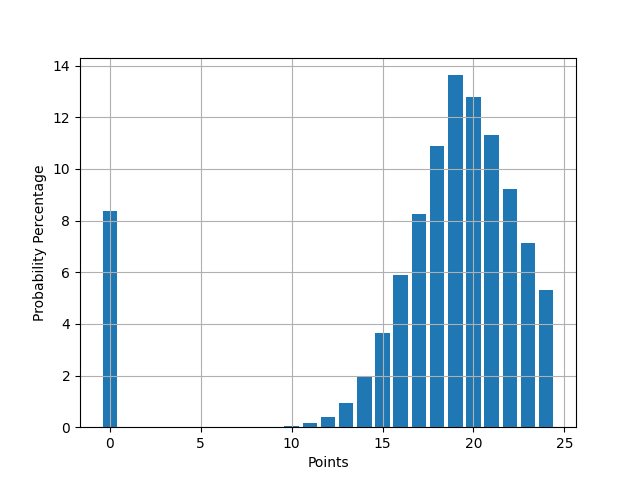
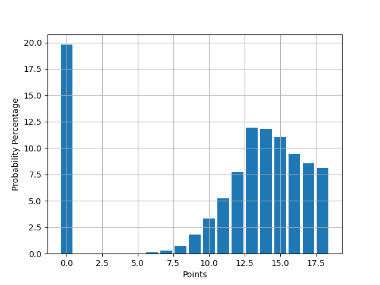

## Midnight Dice Game Probabilities

Using a Monte Carlo approach we generate the probability distribution of points in a game of Midnight.



```
count  1000000.000000
mean        17.791511
std          5.943059
min          0.000000
25%         17.000000
50%         19.000000
75%         21.000000
max         24.000000
```



```
count  1000000.000000
mean        11.372786
std          6.075701
min          0.000000
25%         10.000000
50%         13.000000
75%         16.000000
max         18.000000
```
### Authors
- https://github.com/amansourian
- https://github.com/benjaminykim
- https://github.com/ElliotVilhelm

### References
- https://en.wikipedia.org/wiki/Midnight_(game)
- https://en.wikipedia.org/wiki/Monte_Carlo_method