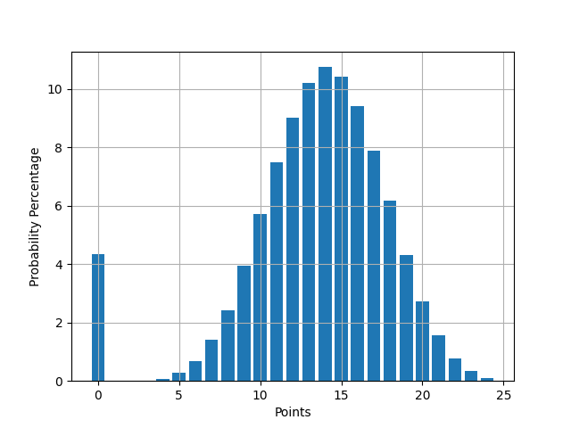
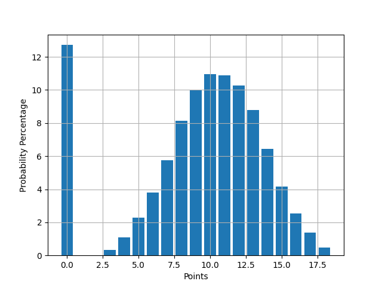

# Midnight Dice Game Probabilities

Using a Monte Carlo approach we generate the probability distribution of points in a game of Midnight. This project started with the desire to answer the question, "What are my odds of rolling a perfect game?". Using a Monte Carlo simulation we were able to answer that question and many more.

- The odds of rolling a perfect game with 6 dice is `~5.2%`.
- The odds of not qualifying with 6 dice is `~8.3%`.

- The odds of rolling a perfect game with 5 dice is `~8.0%`.
- The odds of not qualifying with 5 dice is `~19.8%`.


# Distributions
## 6 Dice
---
### No Strategy

```
std          4.407029
min          0.000000
25%         11.000000
50%         14.000000
75%         16.000000
max         24.000000
```

### With Strategy

```
count  1000000.000000
mean        17.791511
std          5.943059
min          0.000000
25%         17.000000
50%         19.000000
75%         21.000000
max         24.000000
```


## 5 Dice
---
### No Strategy

```
count  1000000.000000
mean         9.269614
std          4.486434
min          0.000000
25%          7.000000
50%         10.000000
75%         12.000000
max         18.000000
```

### With Strategy

```
count  1000000.000000
mean        11.372786
std          6.075701
min          0.000000
25%         10.000000
50%         13.000000
75%         16.000000
max         18.000000
```
## Authors
- https://github.com/amansourian
- https://github.com/benjaminykim
- https://github.com/ElliotVilhelm

## References
- https://en.wikipedia.org/wiki/Midnight_(game)
- https://en.wikipedia.org/wiki/Monte_Carlo_method